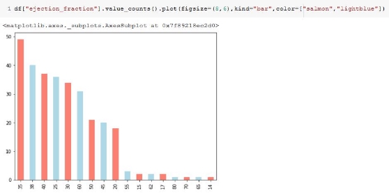
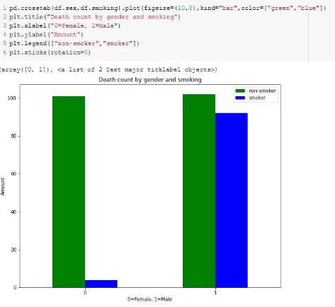
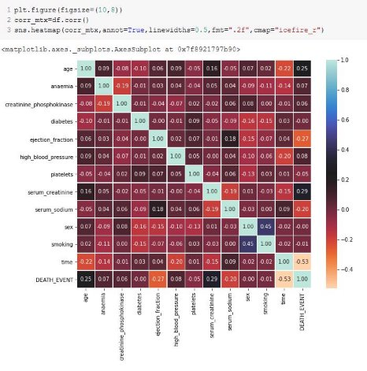
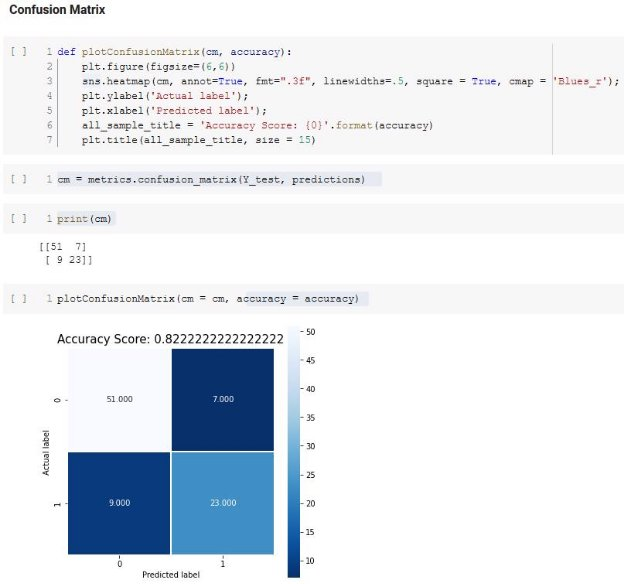

# Supervised Learning on Heart Failure Dataset

## Abstract: 

This report is based on a dataset of Heart Failure. The goal was to visualize the dataset using the Python tools and this project was successfully completed by us. Then we imported the CSV file in Google Colab. Visualization results are shown using various pyplotlib charts. Also find out some results with accuracy rate with the classification of some algorithms. Here we use Logistic Regression, K -Nearest Neighbor, Random Forest, Decision Tree, Naïve bayes algorithms for classification and also ran a ROC curve for each algorithm. 

## Introduction:

The  project  was  to  visualize  data  and  also  classify  those  datasets  using  some  classifier algorithms from datasets. Data visualization can be said as the graphical representation of information and data. By using visual elements like charts, graphs, and maps, data visualization in python using Google Colab. In the world of Big Data, data visualization tools and technologies are essential to analyze massive amounts of information and make data-driven decisions. The dataset contains 1 CSV file that was originally imported into the Google Colab for visualization and classification. The dataset was collected from Kaggle. We preprocessed the dataset using python. After the preprocessing we made some charts and also showed some classification results by using some algorithms in python. 

## Methodology:

The name of the dataset was Heart Failure Dataset. It was a dataset that consists of 1 CSV file. In  each  CSV  there  are  different  rows  and  columns  connected  to  each  other.  Among  the datasets Apps having 299 rows and 13 columns.  

The data consist of various data related to the reasons that might trigger heart failure. Such as gender, Smoker or not or other medical terms that we might not capture if taken lightly. 

Here we uploaded CSV file to Google Drive. With Google Colab we mounted the drive and accessed the CSV file. 

For data visualization and classification Python is better. Python has evolved extensively in every field, be it Automation, Data mining and Machine Learning, Testing, Scraping etc. Python has grown into a large community which is further fueling the growth with new contributors and ecosystem. Python has many visualization tools/libraries which provide excellent features and are easy to implement. It includes support for all types of visual, live, customized Charts and can get results of some classifiers using python. 

## Result & Discussion:

###  Visualization: 

Bar Chart: This bar chart shows “ejection\_fraction”’s per value frequency through a bar chart. The X axis contains the values in the dataframe and the Y axis contains the frequency that they appeared in the dataframe. 

df.info() shows the information of the columns their titles and if they contain any null values also their datatype. 

By this we can see if there is any missing, incomplete or null values in the dataframe. 

This figure shows the number of people who smoked and did not smoke, differentiated by their gender. Using the crosstab() we found out about that.  

This is a histogram of the “ejection\_fraction” trait given in the dataset. 

This shows a correlation matrix visualized with the help of a heatmap. The corr() played a big part in this portion. 

Processing Inputs: 

DEATH\_EVENT is what we will be testing and predicting. 

Splitting the data into train and test in a 7:3 ratio. 

Working with the models: 

We trained the model 

We found out the accuracy 

We prepared a confusion matrix. 

Details(Accuracy, Precision and Recall) of runtime of a particular model. 

ROC chart for a model. 

So, we have done this for all the models. 

1. Trained the model. 
1. Found the accuracy using predictions 
1. Plotted a confusion matrix 
1. Found more details 
1. Plotted a ROC curve 

Results of different models: Logistic Regression 

 

### K Nearest Neighbor 

 

### Random Forest 

 

### Decision Tree 

 

### Naïve Bayes 

 

The best outcome was seen in the Random Forest and the  most  achieved  accuracy  was  0.8444444444444444 84% 

## Conclusion:

The aim of this project was to analyze the dataset of Heart Failure using Python in Google Colab. Visualize charts and classification of algorithms were created by analyzing the entire dataset. Looking at the visualizations, we can see Heart Failure contains 299 rows and 13 columns. The combination of these 1 CSV files explains the whole information about the Heart Failure and after analyzing the algorithms we can see that the best algorithms is Random Forest because its accuracy rate is better than other algorithms.
